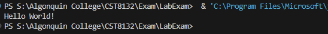
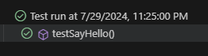
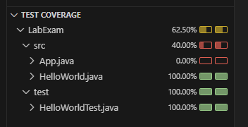
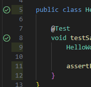

# CST8132 322 Lab Exam

## Pre Lab Exam
This repository is meant for you to prepare your environment for the Lab Exam.

Clone this repo and add set it up in your IDE such that you can ***run*** and ***test*** the provided code with ***coverage***.

Preserve the repository status within your IDE. Meaning that your IDE should edit and save files in the ***same folder as your repo***.  

At the beginning of your Lab Exam this repo will be updated. 

If you have set it up correctly you should be able to **PULL** the new code into your repo and IDE while preserving the configurations you made to run and test this repo.

The less time you spend getting this repo and your testing to run the more time you have to work on the lab exam.

## Notes and Resources
1. You have access to all course material available in Brightspace.
2. You have access to all assignments and labs that you have created during the course.
3. ***Any use of external resources (Google, Stackoverflow), AI (ChatGPT, Co-Pilot), and digital or verbal communication with others will result in a 0 and is subject to the Academic Integrity policy.***

## Output

### Main

*Main Output*

### Test

*Test Status*

*Test Coverage*

*Line Number Coverage Indicators*

**These images depend on your IDE and configuration.**
They may look different depeding on the IDE you use, but the important parts are the information that they carry, and that they are generated when you run and test your application.

#### Good Luck!